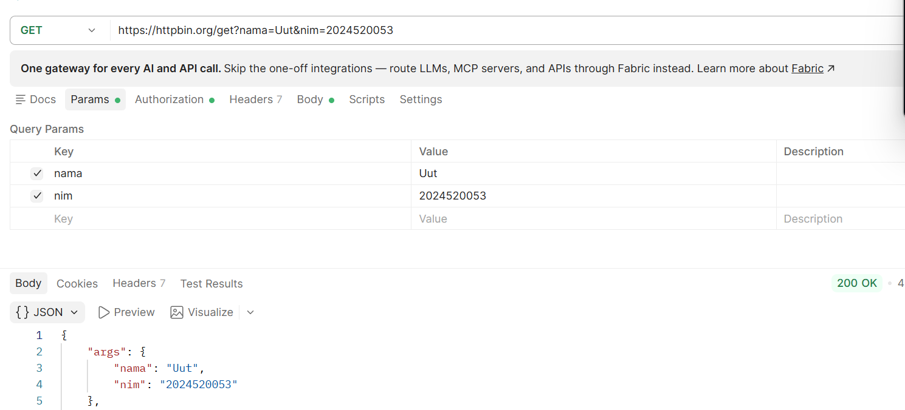
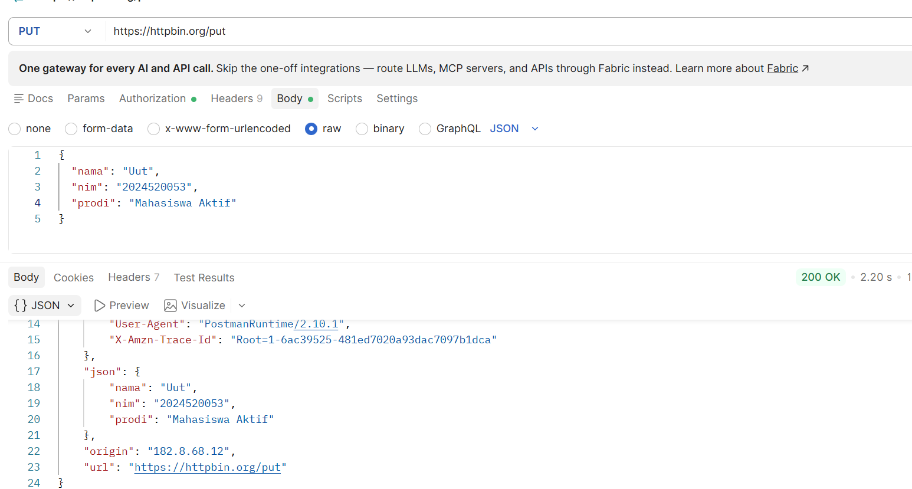
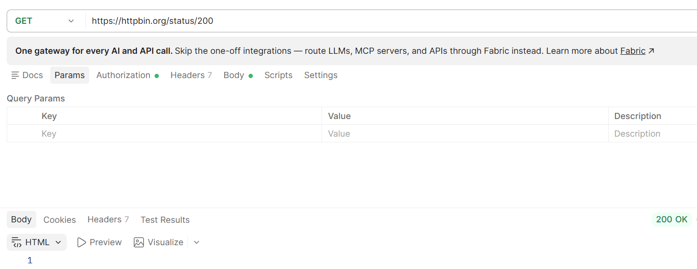
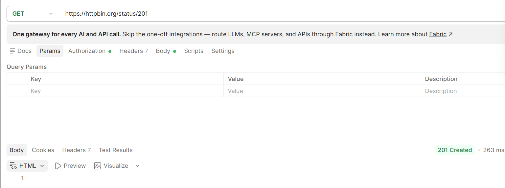
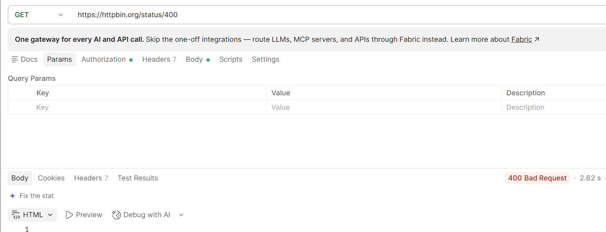
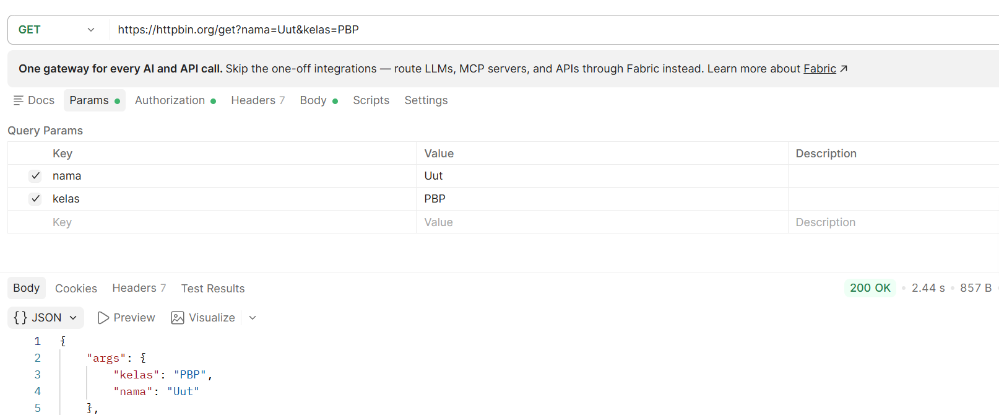
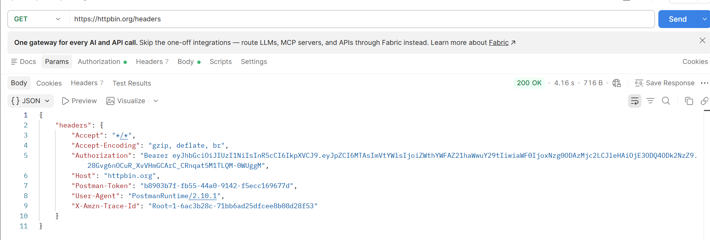

# Kegiatan Praktikum Pertemuan 02

## Judul

Pengujian HTTP Method, HTTP Status Code, serta Request & Response menggunakan Postman dan HTTPBin

## Tujuan

Melakukan pengujian HTTP Method, HTTP Status Code, serta Request & Response menggunakan Postman untuk memahami proses komunikasi HTTP antara client dan server.

Pengujian dilakukan menggunakan HTTPBin sebagai layanan untuk melihat data request yang dikirim oleh client serta memahami status code dan response yang diberikan oleh server.

## Cara Menjalankan

Pengujian dilakukan menggunakan aplikasi Postman dengan langkah-langkah berikut:

1. Membuka aplikasi Postman.
2. Membuat request HTTP sesuai dengan pengujian yang dilakukan.
3. Memasukkan URL HTTPBin.
4. Mengatur method, headers, dan parameter sesuai kebutuhan pengujian.
5. Mengirim request menggunakan tombol **Send**.
6. Mengamati status code dan response yang diberikan oleh server.
7. Menyimpan screenshot hasil pengujian sebagai bukti pengerjaan.

## Hasil

### 1. Pengujian HTTP Method

Pengujian HTTP Method dilakukan menggunakan beberapa method pada HTTPBin.

#### Pengujian GET

Request GET berhasil dikirim ke HTTPBin dan menghasilkan response dari server.

**Bukti hasil pengujian GET:**

#### Pengujian PUT

Request PUT berhasil dikirim ke HTTPBin dan menghasilkan response dari server.

**Bukti hasil pengujian PUT:**

### 2. Pengujian HTTP Status Code

Pengujian HTTP Status Code dilakukan menggunakan endpoint:

`https://httpbin.org/status/:code`

Method yang digunakan adalah **GET**.

Pengujian dilakukan dengan beberapa status code untuk melihat response yang diberikan oleh server.

#### Status Code 200

#### Status Code 201

#### Status Code 400

### 3. Pengujian Request & Response

Pengujian Request dan Response dilakukan menggunakan HTTPBin untuk memahami query parameter dan HTTP Headers.

#### Pengujian GET dengan Query Parameter

Request yang digunakan:

`https://httpbin.org/get?nama=Uut&kelas=PBP`

Pengujian ini digunakan untuk melihat query parameter yang dikirim melalui URL.

#### Pengujian HTTP Headers

Request yang digunakan:

`https://httpbin.org/headers`

Pengujian ini digunakan untuk melihat HTTP Headers yang diterima oleh server.

## Lokasi Bukti

Bukti screenshot hasil pengujian disimpan pada folder:

`Pertemuan-02/tugas-mandiri/backend/kegiatan praktikum/`

### Bukti TM-1

- [tm1-fungsi-get.png](./tm1-fungsi-get.png)
- [tm1-fungsi-put.png](./tm1-fungsi-put.png)

### Bukti TM-2

- [tm2-status-200.png](./tm2-status-200.png)
- [tm2-status-201.png](./tm2-status-201.png)
- [tm2-status-400.png](./tm2-status-400.png)

### Bukti TM-3

- [tm3-get.png](./tm3-get.png)
- [tm3-headers.png](./tm3-headers.png)

## Laporan Tugas

### TM-1 — HTTP Method

Laporan Tugas Mandiri 1 berada pada file:

`tugas-mandiri-1-http-method.md`

### TM-2 — HTTP Status Code

[tugas-mandiri-2-status-code.md](../tugas-mandiri-2-status-code.md)

### TM-3 — Request & Response

[tugas-mandiri-3-request-response.md](../tugas-mandiri-3-request-response.md)