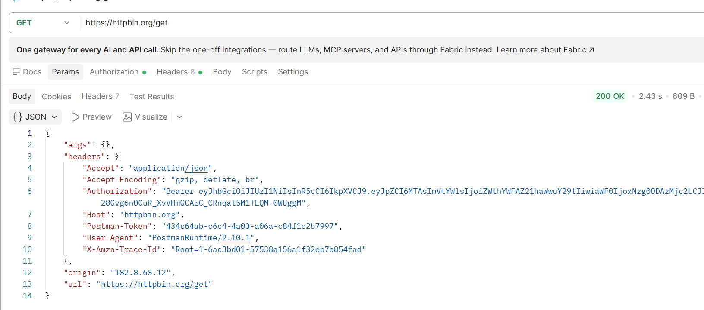
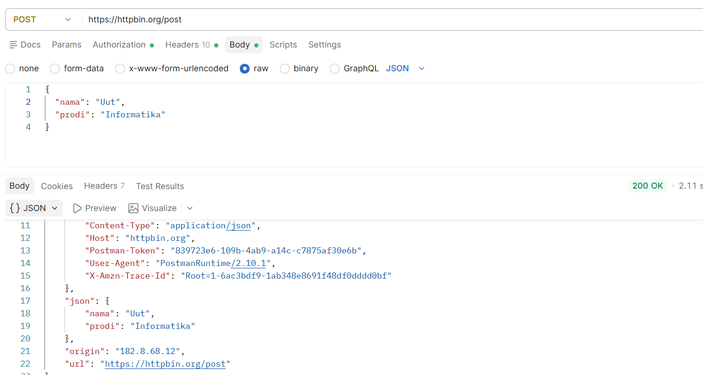
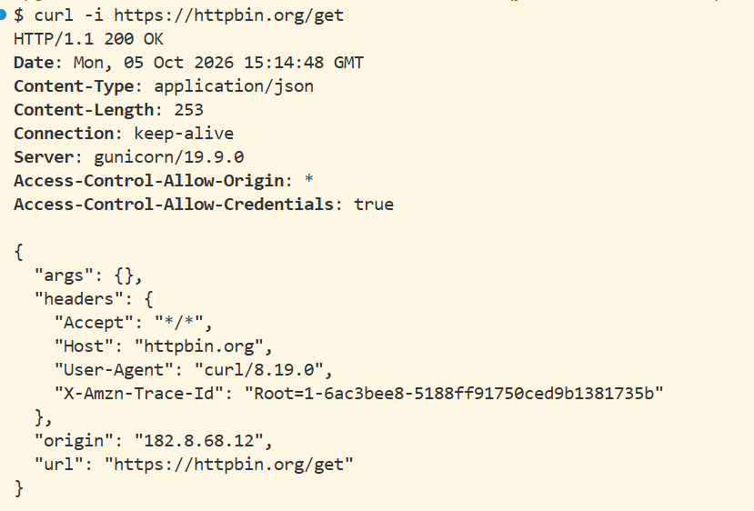
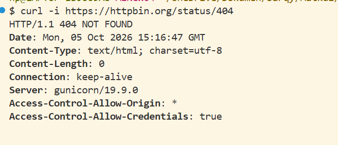
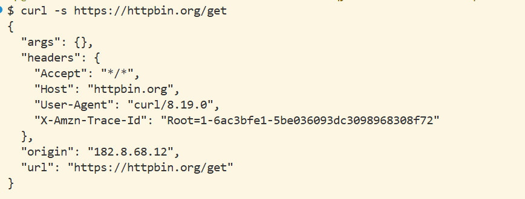

# Kegiatan Praktikum Pertemuan 02

## Judul

Pengujian HTTP Method, HTTP Status Code, Request & Response, serta Pengujian API dengan Postman dan curl

## Tujuan

Melakukan pengujian HTTP Method, HTTP Status Code, Request & Response (termasuk Headers), serta pengujian API menggunakan Postman dan command line (`curl`) untuk memahami proses komunikasi HTTP antara client dan server.

Pengujian dilakukan menggunakan HTTPBin sebagai layanan untuk melihat data request yang dikirim oleh client serta memahami status code dan response yang diberikan oleh server.

## Cara Menjalankan

Pengujian dilakukan menggunakan aplikasi Postman dan terminal/CLI dengan langkah-langkah berikut:

### Menggunakan Postman

1. Membuka aplikasi Postman.
2. Membuat request HTTP sesuai dengan pengujian yang dilakukan.
3. Memasukkan URL HTTPBin.
4. Mengatur method, headers, dan parameter/body sesuai kebutuhan pengujian.
5. Mengirim request menggunakan tombol **Send**.
6. Mengamati status code dan response yang diberikan oleh server.
7. Menyimpan screenshot hasil pengujian sebagai bukti pengerjaan.

### Menggunakan curl

1. Membuka terminal atau command prompt.
2. Menjalankan perintah `curl` dengan opsi yang sesuai (`-i` atau `-s`) ke endpoint HTTPBin.
3. Mengamati header response, status code, dan response body yang ditampilkan.
4. Menyimpan screenshot hasil pengujian pada terminal sebagai bukti pengerjaan.

## Hasil

### 1. Pengujian HTTP Method (TM-1)

Pengujian HTTP Method dilakukan menggunakan method GET dan PUT pada HTTPBin.

#### Pengujian GET

Request GET berhasil dikirim ke HTTPBin dan menghasilkan response dari server.

**Bukti hasil pengujian GET:**

#### Pengujian PUT

Request PUT berhasil dikirim ke HTTPBin dan menghasilkan response dari server.

**Bukti hasil pengujian PUT:**

### 2. Pengujian HTTP Status Code (TM-2)

Pengujian HTTP Status Code dilakukan menggunakan endpoint:

`https://httpbin.org/status/:code`

Method yang digunakan adalah **GET**.

Pengujian dilakukan dengan beberapa status code untuk melihat response yang diberikan oleh server.

#### Status Code 200

#### Status Code 201

#### Status Code 400

### 3. Pengujian Request & Response (TM-3)

Pengujian Request dan Response mencakup pengujian fungsi GET menggunakan parameter serta pengujian HTTP Headers pada HTTPBin.

#### Pengujian GET

#### Pengujian Headers

### 4. Pengujian API dengan Postman dan curl (TM-4)

Pengujian dilakukan untuk membandingkan request GET dan POST menggunakan Postman serta pengujian perintah `curl -i` dan `curl -s` melalui terminal.

#### Pengujian GET di Postman

#### Pengujian POST di Postman

#### Pengujian GET di Terminal

#### Pengujian curl -i Status 404

#### Pengujian curl -s

## Lokasi Bukti

Bukti screenshot hasil pengujian disimpan pada folder:

`Pertemuan-02/tugas-mandiri/backend/kegiatan praktikum/`

### Bukti TM-1

- [tm1-fungsi-get.png](./tm1-fungsi-get.png)
- [tm1-fungsi-put.png](./tm1-fungsi-put.png)

### Bukti TM-2

- [tm2-status-200.png](./tm2-status-200.png)
- [tm2-status-201.png](./tm2-status-201.png)
- [tm2-status-400.png](./tm2-status-400.png)

### Bukti TM-3

- [tm3-get.png](./tm3-get.png)
- [tm3-headers.png](./tm3-headers.png)

### Bukti TM-4

- [tm4-pengujian-404-diterminal.png](./tm4-pengujian-404-diterminal.png)
- [tm4-pengujian-curl-s-diterminal.png](./tm4-pengujian-curl-s-diterminal.png)
- [tm4-pengujian-get-dipostman.png](./tm4-pengujian-get-dipostman.png)
- [tm4-pengujian-get-diterminal.png](./tm4-pengujian-get-diterminal.png)
- [tm4-pengujian-post-dipostman.png](./tm4-pengujian-post-dipostman.png)

## Laporan Tugas

### TM-1 — HTTP Method

[tugas-mandiri-1-http-method.md](../tugas-mandiri-1-http-method.md)

### TM-2 — HTTP Status Code

[tugas-mandiri-2-status-code.md](../tugas-mandiri-2-status-code.md)

### TM-3 — Request & Response

[tugas-mandiri-3-request-response.md](../tugas-mandiri-3-request-response.md)

### TM-4 — Pengujian API dengan Postman dan curl

[tugas-mandiri-4-postman-curl.md](../tugas-mandiri-4-postman-curl.md)